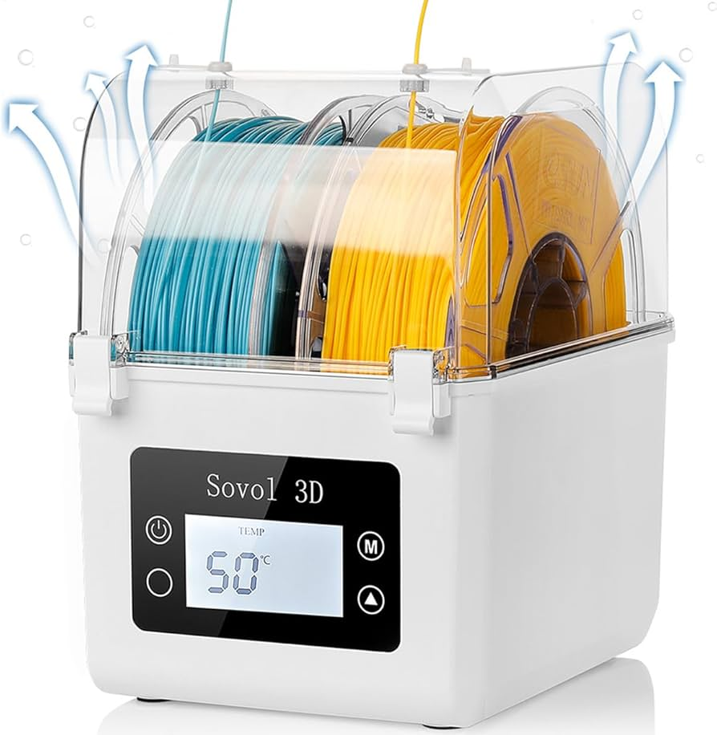
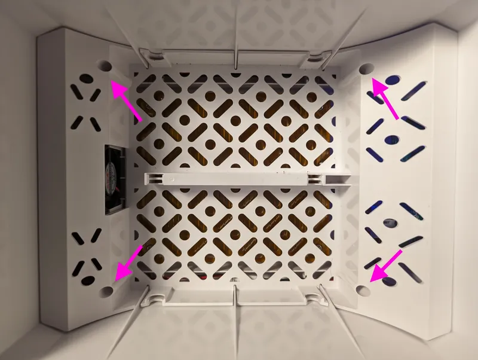
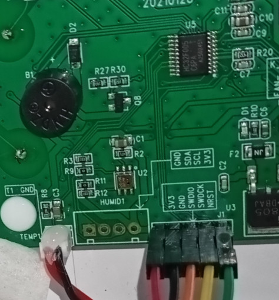

# SOVOL / COMGROW dryer firmware

The SOVOL SH01 has default firmware limitations that only allows the heater to run for a maximum of 12 hours. After this, the heater automatically shuts off. During operation, the box lid must remain open to release humidity, but it needs to be closed once the drying process is complete.
Drying filament spools can take a day or more to ensure proper results. However, the 12-hour limit requires frequent manual resets, which can be inconvenient and easy to forget. If the heater shuts off and the lid is left open, the filament may reabsorb humidity, forcing you to restart the drying process.

Increasing this runtime limit is the key to happy filament drying.

## Firmware files

### fw.hex

[download](./fw.hex)

This is the original firmware.

* single push to power on
* temperature: 40C (default), 45C, 50C
* runtime: 6h (default), 7h, 8h, 9h, 10h, 11h, 12h

### fw-48h.hex

[download](./fw-48h.hex)

* push-and-hold to power on
* temperature: 40C, 45C, 50C (default)
* runtime: 6h (default), 8h, 10h, 12h, 14h, 16h, 18h, 20h, 22h, 24h, 26h, 28h, 30h, 32h, 34h, 36h, 38h, 40h, 42h, 44h, 46h, 48h

## Flashing your dryer

> [!CAUTION]
> Attempting to program your dryer may cause irreparable damage if done incorrectly. I'm not liable for any damage you may do to your device. Proceed at your own risk.

You will need:

* A SOVOL SH01 (SH02 may also work - check the chip)
* A Phillips screwdriver
* A PC (or VM with access to USB)
* A USB to serial adapter (See suggested adapters below. Some adapters have been reported to not work work)

> [!IMPORTANT]
> Which USB to serial adapter you use is critical.
>
> Working:
> * [DSD TECH SH-U09C5 FT232NL](https://a.co/d/hOHlUrl)
> * [Flipper Zero](https://shop.flipperzero.one/)
> 
> Not working:
> * [Adafruit FTDI Friend FT232RL](https://www.adafruit.com/product/284)
> * [BAITE BTE13-007 CP2102 bridge](https://www.taydaelectronics.com/datasheets/files/A-1991.pdf)

1. Remove the four screws and remove the dryer tray

2. Confirm that the chip on your board is a `HC32F005x6xx`. The numbering is small and in an awkward location, try taking a photo with your phone.** If the chip does not match, these firmware files will likely cause irreparable damage. Do not proceed.**

3. Configure your USB to serial adapter to send 3.3V

4. Connect your USB to serial adapter to the dryer
Pinout For DSD TECH SH-U09C5 FT232NL
| SH01 pin | serial adapter pin |
|----------|--------------------|
| 3V3      | VCC                |
| GND      | GND                |
| SWDIO    | TX                 |
| SWDCK    | RX                 |
| NRST     | RTS                |

Pin Out for Flipper Zero
| SH01 pin |  Flipper Zero pin  |
|----------|--------------------|
| 3V3      | Pin 9(3V3)         |
| GND      | Pin 11(GND         |
| SWDIO    | Pin 13(TX)         |
| SWDCK    | Ping 14(RX)        |
| NRST     | Pin 2(A7)          |

5. Connect your USB to serial adapter to your Windows machine.

6. Download the [HDSC MCU programmer](https://github.com/Xinyuan-LilyGO/T-HC32/blob/main/tools/HDSC%20ISP.zip)

7. Configure the programmer ([manual in english](./hdsc-mcu-programmer-manual-en.pdf)):

	a. Click the first menu dropdown and select English.

	

	b. Configure the MCU as `HC32L110x6xx/HC32F005x6xx`

	c. Select a baud rate, slower will be more reliable (I used 9600)

	d. Download and select a [firmware file](#firmware%20files)

	e. Configure the COM port to be your USB to serial device (unplug/replug it in if you're not sure which is the correct port)

	f. Push the `Upload` button (the left one) to download the current firmware from the chip (you will be prompted for a location to save the file)

 	g. Push the `Execute` button (the right one) to write the selected firmware to the chip
	
	

9. That's it! Now keep reading...

### Sharing your findings

Please [report your success / failure](https://github.com/rcambrj/sovol-dryer-firmware/discussions/new?category=reports-of-success-failure&title=It+worked+/+didn't+work&body=*+Dryer+brand+%26%20model:%20eg.%20SOVOL%20SH01%0A*%20Chip%20identifier:%20eg%20HC32F005x6xx%0A*%20USB%20to%20serial%20adapter:%20eg.%20DSD%20TECH%20SH-U09C5) so that we can all learn from it.

## Improving the firmware further

Do you know how to decompile+recompile these files? Please help! It'd be great to further improve them.

## Credits

anselor_557733 for [the photo of the inside of the dryer](https://www.printables.com/model/734639-custom-insert-for-sovol-sh01-comgrow-filament-drye). I'm really lazy.
